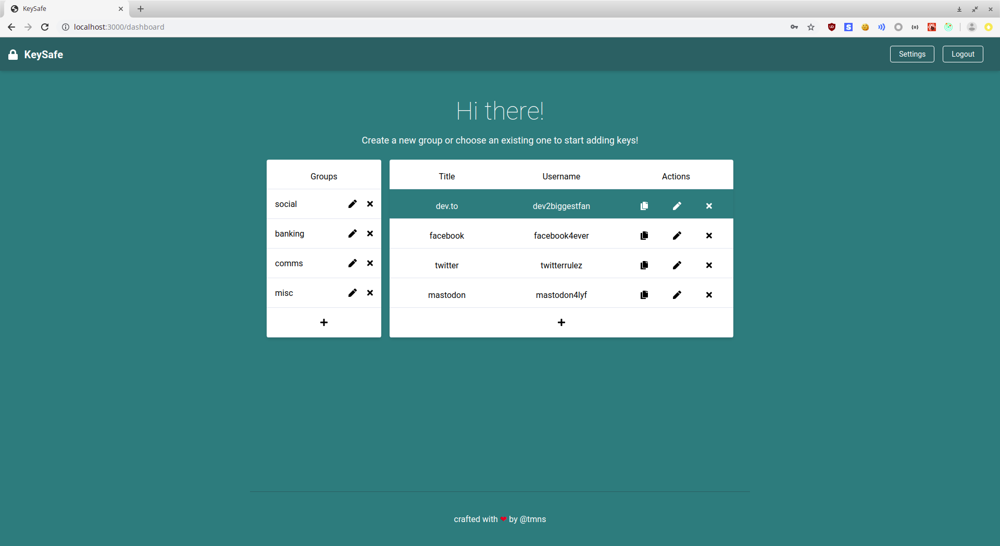

# KeySafe



KeySafe is an app for storing all your passwords / keys. Designed to be as simple to use as possible. All data is encrypted client-side - so only you know what you're storing! Built with the help of React, Redux, Formik, Tailwind, Express / Node, Mongoose / MongoDB. You can give it a spin [here](https://keysafeapp.herokuapp.com).

Most of the main functionality has been completed. You can:

- Register user
- Edit username
- Delete user
- Create group
- Edit group
- Delete group
- Create key
- Edit key
- Delete key

Note that the app generates a random, strong password for you every time you use the add-a-key form - you can either use this password or enter your own.

## Encryption

All data (group and key details) is encrypted client-side with symmetric key encryption (AES) before being stored in the database. The data is then decrypted client-side whenever it is retrieved. This is done with the help of `bcryptjs` and `crypto-js`. Further, the server is never sent your encryption / decryption key and as such cannot decrypt your data server-side (assuming the application code has not been maliciously altered). 

This is achieved by creating a unique salt for each user upon registration, which is stored on the server. Then, upon each successful login, the salt is retrieved by the client and the encrypt / decrypt key is generated by hashing the user's salt combined with the user's password. This key is thereafter stored in the user's local storage until deauthentication.

Relevant files to take a look at for inspecting the encryption scheme include: 

- `client/src/util/crypto.js` 
- `client/src/components/auth/Register.js` 
- `client/src/actions/authActions.js`
- `client/src/components/dashboard/Table.js`
- `client/src/components/dashboard/KeyModal.js`
- `client/src/components/dashboard/EditGroupModal.js`

## Build
To build, `cd` to project root and run:
```
$ npm install && npm run build
```
This should install dependencies and then output a transpiled version of app.js to `dist`.

## Run
To run the app in development, it is suggested you use the following command from the project root:
```
$ npm run dev
```
This will utilize `concurrently` to run both the server and client simultaneously. If instead you wish to run them independently, see the project's `package.json` for the relavent script commands.

## Usage
First, before running you will want to set up a Mongo database, which can be local or remote. Once this is done you can plug it's URI into the `DB_URI` variable of `server/config/config.js`.

After that, you should be able to run the app and create a user account. From there, you can add groups, add keys, edit them, etc.

## License
The source of this app may be used under the WTFPL - or, if you take issue with that, consider it to be under the CC0.

## Contributing
Feedback and contributions are welcome. Feel free to create issues, fork, submit pull requests, etc.

Finally, if you want to contribute in a different way, you can always buy me a coffee ^_^

[](https://www.buymeacoffee.com/tmns)

*Note: This app is not related to the Android app of the same name in any way!* 